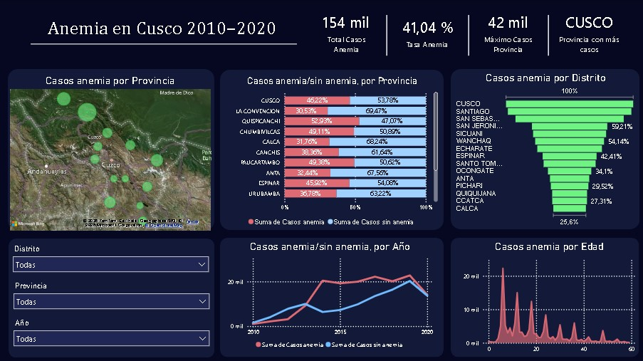

# Proyecto6_Anemia_Cusco - 2010–2020

**“Identificamos patrones de anemia en Cusco para orientar políticas de salud pública.”**

---

## 1. Problema de Negocio
El Gobierno Regional de Cusco enfrenta una alta incidencia de anemia en niños y adolescentes entre 2010 y 2020.  
Los datos estaban dispersos y con errores de calidad, lo que dificultaba responder preguntas clave:  
- ¿Qué provincias concentran más casos?  
- ¿Qué grupos de edad son los más afectados?  
- ¿La tendencia mejora o empeora con los años?  
- ¿Qué establecimientos requieren mayor apoyo?  

---

## 2. Datos
|Titulo|Detalle|
|--|--|
|**Fuente**| Plataforma Nacional de Datos Abiertos - Perú|
|**Tamaño** |83413 filas, 14 columnas | 
|**Descripción**| Casos de anemia y normales por edad, año, provincia, distrito y establecimiento de salud  
|**Diccionario de datos** |Archivo excel proporcionado por la página de Datos Abiertos, para saber la descripción de cada columna de los datos que usaremos en este proyecto.|

---

## 3. Herramientas y Tecnologías
- Power Query (ETL)  
- Power BI (visualización)  
- GitHub (portafolio y versionado)  

---

## 4. Proceso / Metodología
1. **Limpieza**  
   - Reemplazo de valores nulos en PROVINCIA, DISTRITO, COD_EESS, UBIGEO  
   - Validación de sumas CASOS + NORMAL = TOTAL  
   - Normalización de formatos y tipos de datos
   - Renombramiento de columnas para facilidad lectora
   - Eliminación de columnas que no aportarán valor en este proyecto (Ubigeo, FechaCorte, MicroRed,Codigo EESS)

2. **Análisis**  
   - Creación de medidas:  
     - Total de casos de anemia
     - Tasa de anemia = Casos anemia / Total Casos
     - Distribución por provincia  (en porcentaje)
     - Provincia con más casos de anemia

3. **Visualización**  
   - Gráficos:  
     - Mapa geográfico por Departamento - Provincia - Distrito 
     - Serie temporal de casos (anemia y sin anemia) (2010–2020)  
     - Gráfico de áreas por edad  
     - Comparación Casos con anemia vs Casos sin anemia, por provincia  
     - Embudo de los 15 distritos con más casos de anemia
     - Sección de tablas para analizar a detalle

---

## 5. Hallazgos Clave / Insights

1. **Provincias con mayor prevalencia de anemia**

   Según el gráfico de columnas, las provincias con más casos son **Cusco (42,451), La Convención (20,156) y Quispicanchi (16,369)**.  
  En conjunto, estas tres provincias concentran **más del 50% de los casos reportados en la región** (Cusco 27.5%, La Convención 13.0% y Quispicanchi 10.6%).
  Este hallazgo evidencia que la **focalización de recursos y programas de salud pública** debe priorizarse en estas zonas críticas para lograr un mayor impacto en la reducción de la anemia.

2. **Grupos de edad más afectados**  

   El análisis por edad muestra picos de incidencia en los grupos de **6, 12 y 18 años**, con una disminución progresiva en edades mayores.  
   Esto confirma que la anemia afecta principalmente a **niños y adolescentes**, etapas de mayor vulnerabilidad nutricional, lo que sugiere reforzar programas de suplementación y educación alimentaria en estas cohortes.

3. **Tendencia temporal 2010–2020**  

   La serie temporal revela un crecimiento sostenido de casos entre 2010 y 2019, seguido de un **leve descenso hacia 2020**.  
   Este comportamiento podría reflejar el impacto de **políticas de suplementación y campañas de salud** implementadas en los últimos años, aunque la prevalencia sigue siendo alta.

4. **Redes de salud con mayor carga de casos**  

   El análisis muestra que la distribución de anemia no es homogénea, sino que se concentra en determinadas **redes de salud**.  
   Las más afectadas son **Cusco Sur (55,859 casos) y Cusco Norte (52,493 casos)**, que en conjunto representan **un poco más del 70% del total de casos registrados en la región**.  
   Otras redes como **Canas–Canchis–Espinar (20,607 casos)** y **La Convención (14,220 casos)** presentan cargas intermedias, mientras que **Kimbiri–Pichari (5,662 casos)** y **Chumbivilcas (5,553 casos)** registran cifras menores.  
   Este hallazgo evidencia que las **redes Cusco Sur y Cusco Norte son puntos críticos de intervención**, donde reforzar la atención primaria, el diagnóstico temprano y la distribución de suplementos nutricionales tendría un impacto más rápido y efectivo en la reducción de la anemia.

5. **Distritos con mayor carga de casos de anemia**

   El análisis por distrito revela que **Cusco (10,229), Santiago (9,936), San Sebastián (8,707) y San Jerónimo (6,057)** concentran en conjunto más de **35,000 casos de anemia**, convirtiéndose en los principales focos de intervención.  
   Distritos como **Sicuani, Wanchaq y Echarate** presentan cargas intermedias (5,000–6,000 casos), mientras que **Espinar, Santo Tomás, Ocongate y Anta** registran cifras menores, aunque igualmente relevantes.  
   Este hallazgo permite identificar **zonas críticas y zonas de vigilancia**, facilitando la priorización de recursos en salud pública.

---

## 6. Recomendaciones / Impacto

1. **Focalización territorial**  
   Lo primero que se me ocurriría es priorizar intervenciones en las provincias críticas (**Cusco, La Convención y Quispicanchi**) y en las redes de salud **Cusco Sur y Cusco Norte**, que concentran más del 70% de los casos.  

2. **Programas dirigidos a grupos vulnerables**  
   Para evitar más casos, se debe reforzar campañas de suplementación y educación alimentaria en **niños y adolescentes (6, 12 y 18 años)**, los cuales son los principales grupos afectados.  

3. **Fortalecimiento de la atención primaria**  
   Mejorar la capacidad de diagnóstico temprano y tratamiento en los **centros de salud y distritos con mayor carga de casos** (Cusco, Santiago, San Sebastián, San Jerónimo).  

4. **Monitoreo y evaluación continua**  
   Implementar sistemas de seguimiento anual para evaluar la evolución de la anemia y medir el impacto de las políticas de suplementación.  

5. **Redistribución de recursos**  
   Optimizar la asignación de suplementos nutricionales, personal médico y campañas educativas hacia las zonas con mayor prevalencia, evitando una distribución uniforme que diluya el impacto.  

<image src="DashboardTablas.jpg" alt="Descripción de la imagen">

   ---

## 7. Links
- **Dashboard Interactivo**: [DASHBOARD](Proyecto%ANEMIA-CUSCO.pbix)  
- **Diccionario de datos**: [Data Dictionary - Anemia Cusco 2010-2020](DiccionarioDatos_ANEMIACUSCO.xlsx)  
- **Fuente de datos**: [Plataforma Nacional de Datos Abiertos](https://www.datosabiertos.gob.pe/dataset/casos-de-anemia-por-edades-entre-los-a%C3%B1os-2010-2020-en-la-region-de-cusco)
---

## 8. Cómo ejecutar el proyecto

1. Descarga la carpeta del proyecto que incluye todos los archivos necesarios o clona el repositorio.
2. Abre el archivo .pbix en Power BI.
3. Explora el dashboard utilizando los filtros disponibles.
4. Revisa las tablas para obtener información detallada del caso.
